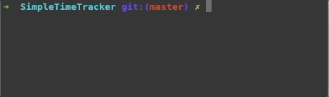

Command Line Time Tracking Tools
================================

The repo contains command line tools helpful with time tracking from terminal. They take up minimal amount of screen space (since they have no UI) and are easy to use. 

Countdown Timer CLI (WIP)
-------------------------

A simple command line countdown timer. 

Simple Time Tracker CLI
-----------------------

Tracks time spend on a single activity. You can optionally name the task in progress. 

You can also track how much money you've made so far by executing the task so far (optional). 

(image from an older release)

Pomodoro Timer CLI
------------------

Pomodoro technique command line timer. Pomodoro lasts 25 minutes followed by 5 minutes break. 

If you're not familiar with the technique, watch the introductory video here: http://pomodorotechnique.com

